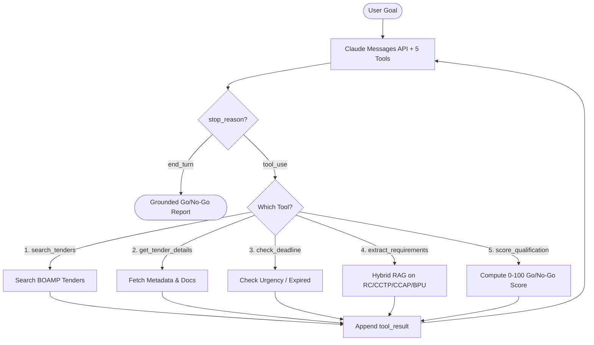

# Tender AI Agent Architecture

```mermaid
flowchart TD
    Start([User Goal]) --> Claude[Claude Messages API + 5 Tools]
    Claude --> Decision{stop_reason?}
    Decision -- end_turn --> FinalReport([Grounded Go/No-Go Report])
    Decision -- tool_use --> Router{Which Tool?}
    Router -- 1. search_tenders --> T1[Search BOAMP Tenders]
    Router -- 2. get_tender_details --> T2[Fetch Metadata & Docs]
    Router -- 3. check_deadline --> T3[Check Urgency / Expired]
    Router -- 4. extract_requirements --> T4[Hybrid RAG on RC/CCTP/CCAP/BPU]
    Router -- 5. score_qualification --> T5[Compute 0-100 Go/No-Go Score]
    T1 & T2 & T3 & T4 & T5 --> Result[Append tool_result] --> Claude
```
